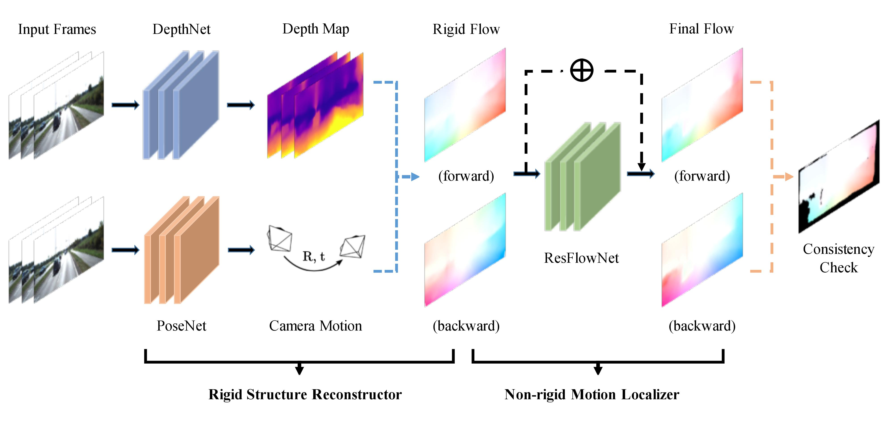

# GeoNet

This is a Tensorflow implementation of our paper:

GeoNet: Unsupervised Learning of Dense Depth, Optical Flow and Camera Pose (CVPR 2018)

Zhichao Yin and Jianping Shi

arxiv preprint: (https://arxiv.org/abs/1803.02276)



## Requirements

This code has been tested with Python2.7, TensorFlow 1.1 and CUDA 8.0 on Ubuntu 16.04.

## Data preparation

For replicating our results in all of the three tasks (monocular depth, camera pose and optical flow), 
you need to download the following datasets, and preprocess them into certain formats:

### [KITTI](http://www.cvlibs.net/datasets/kitti/index.php)
For **depth** and **flow** tasks, the training data is [KITTI raw dataset](http://www.cvlibs.net/datasets/kitti/raw_data.php) 
and you can download them by the [official script](http://www.cvlibs.net/download.php?file=raw_data_downloader.zip);

For **pose** task, the training data is [KITTI odometry dataset](http://www.cvlibs.net/download.php?file=data_odometry_color.zip) 
and you should download the calibration files as well as ground truth poses (for evaluation).

After downloaded the data, you can run the following command for preprocessing:
```bash
python data/prepare_train_data.py --dataset_dir=/path/to/kitti/dataset/ --dataset_name=kitti_split --dump_root=/path/to/formatted/data/ --seq_length=3 --img_height=128 --img_width=416 --num_threads=16
```

For **depth** task, the `--dataset_name` should be `kitti_raw_eigen` and adding `--remove_static` flag is suggested;

For **flow** task, the `--dataset_name` should be `kitti_raw_stereo` (`--remove_static` is left out for learning optical flow in generic cases);

For **pose** task, the `--dataset_name` should be `kitti_odom` and `--seq_length` is set to `5`.

### [Cityscapes](https://www.cityscapes-dataset.com/)
You can optionally pretrain the model on Cityscapes dataset for any of the three tasks. The required training 
data is image sequence `leftImg8bit_sequence_trainvaltest.zip` and calibration file `camera_trainvaltest.zip`. 
After downloaded them, simply run:
```bash
python data/prepare_train_data.py --dataset_dir=/path/to/cityscapes/dataset/ --dataset_name='cityscapes' --dump_root=/path/to/formatted/data/ --seq_length=3 --img_height=171 --img_width=416 --num_threads=16
```

## Training
Our code supports two training modes, corresponding to our stage-wise training strategy. 
The `train_rigid` mode is mainly for learning depth and pose, while `train_flow` mode supports direct or residual flow learning.

For ``train_rigid`` mode (**depth** and **pose** tasks), run the command
```bash
python geonet_main.py --mode=train_rigid --dataset_dir=/path/to/formatted/data/ --checkpoint_dir=/path/to/save/ckpts/ --learning_rate=0.0002 --seq_length=3 --batch_size=4 --max_steps=350000 
```
You can switch the network encoder by setting `--dispnet_encoder` flag, or perform depth scale normalization (see [this paper](https://arxiv.org/abs/1712.00175) for details) by setting `--scale_normalize` as True.
Note that for replicating depth and pose results, the `--seq_length` is suggested to be 3 and 5 respectively.

For ``train_flow`` mode (**flow** task), run the command
```bash
python geonet_main.py --mode=train_flow --dataset_dir=/path/to/formatted/data/ --checkpoint_dir=/path/to/save/ckpts/ --learning_rate=0.0002 --seq_length=3 --flownet_type=direct --max_steps=400000
```
You can choose to learn direct or residual flow by setting `--flownet_type` flag. **Note** that when the `--flownet_type` is `residual`, the `--init_ckpt_file` should be specified to point
at a model pretrained on the same dataset with mode of `train_rigid`. Also a `max_steps` more than 200 epochs is preferred for learning residual flow.

### Pretrained models
You can download our pretrained models as well as their predictions in all of the three tasks from [[Google Drive](https://drive.google.com/open?id=1VSGpdMrQ3dFKdher_2RteDfz7F0g57ZH)]. **Note** that they were trained according to **different splits** of KITTI as described in the paper. Following the testing and evaluation instructions below, you should obtain similar results as reported in the paper.

#### Notes about depth scale normalization
Following most of the original hyperparameters but setting `--scale_normalize` as True, we have trained our DepthNet better on the Eigen's split of KITTI. The pretrained model is also provided, namely **model_sn** in **geonet_depthnet** subfolder. Note this is not included in our paper, but the performance is further improved:

| Abs Rel | Sq Rel | RMSE  | RMSE(log) | Acc.1 | Acc.2 | Acc.3 |
|---------|--------|-------|-----------|-------|-------|-------|
| 0.149   | 1.060  | 5.567 | 0.226     | 0.796 | 0.935 | 0.975 |

## Testing
We provide testing and evaluation scripts for all of the three tasks.

### Monocular Depth
Run the following command
```bash
python geonet_main.py --mode=test_depth --dataset_dir=/path/to/kitti/raw/dataset/ --init_ckpt_file=/path/to/trained/model/ --batch_size=1 --depth_test_split=eigen --output_dir=/path/to/save/predictions/
```
Then you can evaluate the prediction by running
```bash
python kitti_eval/eval_depth.py --split=eigen --kitti_dir=/path/to/kitti/raw/dataset/ --pred_file=/path/to/predictions/
```

### Camera Pose
Firstly assuming you have downloaded the KITTI odometry dataset (including groundtruth poses), run
```bash
python geonet_main.py --mode=test_pose --dataset_dir=/path/to/kitti/odom/dataset/ --init_ckpt_file=/path/to/trained/model/ --batch_size=1 --seq_length=5 --pose_test_seq=9 --output_dir=/path/to/save/predictions/
```
Now you have predicted pose snippets. You can **generate the groundtruth pose snippets** by running
```bash
python kitti_eval/generate_pose_snippets.py --dataset_dir=/path/to/kitti/odom/dataset/ --output_dir=/path/to/save/gtruth/pose/snippets/ --seq_id=09 --seq_length=5
```
Then you can evaluate your predictions by
```bash
python kitti_eval/eval_pose.py --gtruth_dir=/path/to/gtruth/pose/snippets/ --pred_dir=/path/to/predicted/pose/snippets/
```

### Optical Flow
Firstly you need to download the [KITTI flow 2015 dataset](http://www.cvlibs.net/download.php?file=data_scene_flow.zip) and its [multi-view extension](http://www.cvlibs.net/download.php?file=data_scene_flow_multiview.zip). 
For replicating our flow results in the paper, a `seq_length` of 3 is recommended. You need to format the testing data by running
```bash
python kitti_eval/generate_multiview_extension.py --dataset_dir=/path/to/data_scene_flow_multiview/ --calib_dir=/path/to/data_scene_flow_calib/ --dump_root=/path/to/formatted/testdata/ --cam_id=02 --seq_length=3
```
Then you can test your trained model by
```bash
python geonet_main.py --mode=test_flow --dataset_dir=/path/to/formatted/testdata/ --init_ckpt_file=/path/to/trained/model/ --flownet_type=direct --batch_size=1 --output_dir=/path/to/save/predictions/
```
We again provide evaluation script:
```bash
python kitti_eval/eval_flow.py --dataset_dir=/path/to/kitti_stereo_2015/ --pred_dir=/path/to/predictions/
```

## Acknowledgements
We thank [Tinghui Zhou](https://github.com/tinghuiz/SfMLearner) and [Clément Godard](https://github.com/mrharicot/monodepth) for their great work and repo.

## Reference
If you find our work useful in your research please consider citing our paper:
```
@inproceedings{yin2018geonet,
  title     = {GeoNet: Unsupervised Learning of Dense Depth, Optical Flow and Camera Pose},
  author    = {Yin, Zhichao and Shi, Jianping},
  booktitle = {CVPR},
  year = {2018}
}
```
